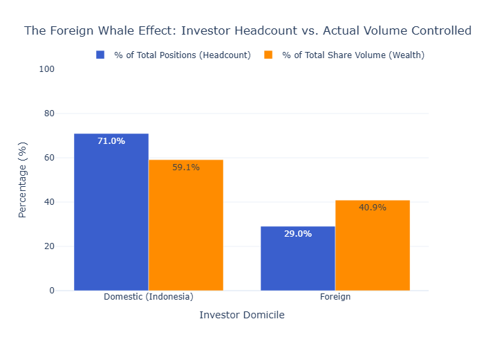
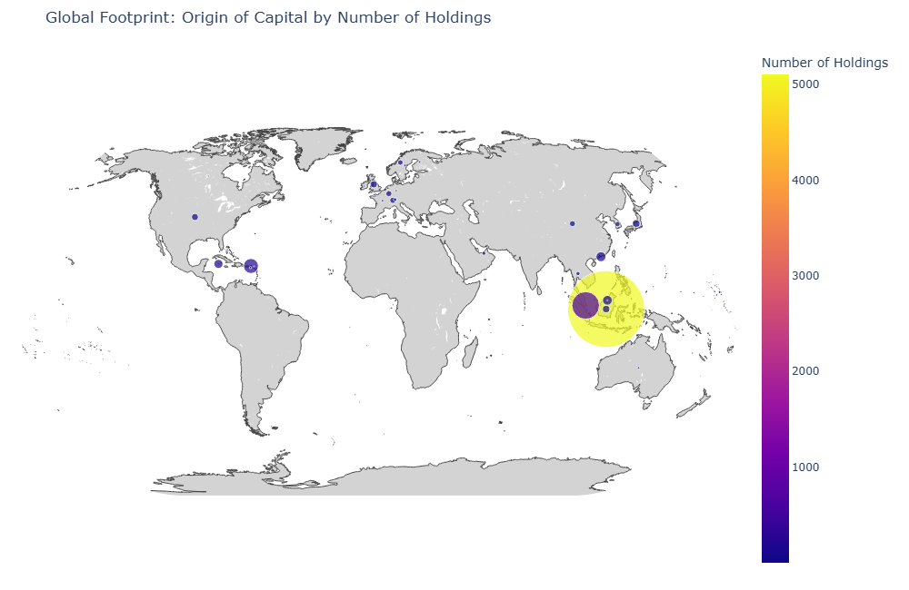
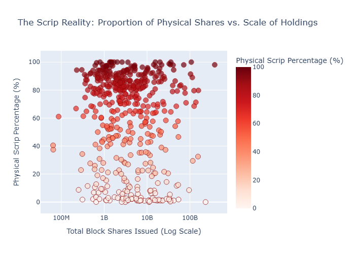
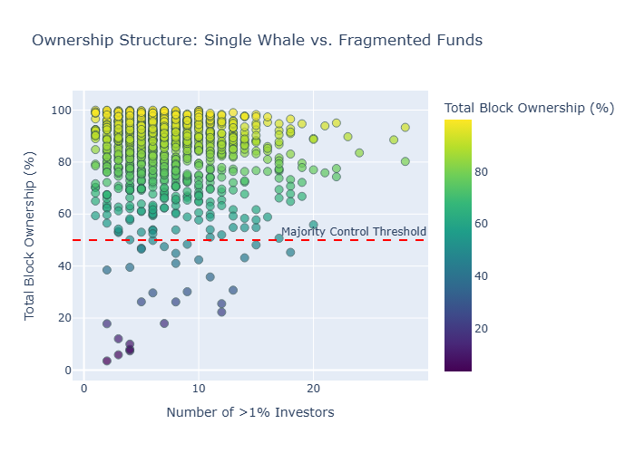
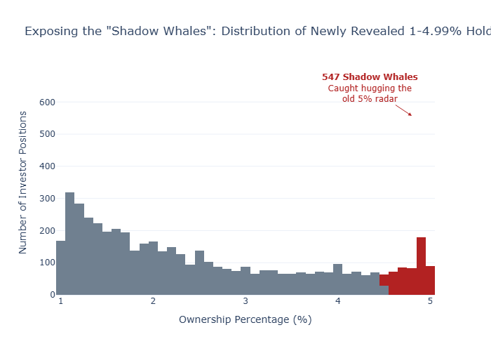

# Indonesia Regulatory Equity Ownership Analysis

**Analysis of Regulatory Change Regarding Equity Ownership and Market Regime Shifts**

---


[](https://jordanchongja.github.io/notes/posts/indonesia-regulatory-equity-ownership-analysis/)

## Part 0: Rationale
This project originated from a technical assessment where I was tasked with extracting and analyzing equity ownership data from Indonesian Financial Services Authority (OJK) filings. The core challenge involved parsing complex PDF tables and identifying the impact of the 2026 regulatory shift that lowered the public reporting threshold from 5% to 1%.

<details>
<summary><b>Show Data Processing Logic (Python/Tabula)</b></summary>

```python
# Extraction logic using Tabula-py to handle 65+ pages of PDF tables
import tabula
import pandas as pd

def simple_extract(file_path):
    tables = tabula.read_pdf(file_path, pages='all', multiple_tables=True)
    df = pd.concat(tables, ignore_index=True)
    # Cleaning dots (thousands) and commas (decimals) for IDR standards
    numeric_cols = ['HOLDINGS_SCRIPLESS', 'HOLDINGS_SCRIP', 'TOTAL_HOLDING_SHARES', 'PERCENTAGE']
    for col in numeric_cols:
        df[col] = df[col].astype(str).str.replace('.', '').str.replace(',', '.')
        df[col] = pd.to_numeric(df[col], errors='coerce')
    return df
```
</details>

---

## Part 1: Regulatory Context
In early 2026, Indonesia's **Otoritas Jasa Keuangan (OJK)** introduced Decree No. 1/KDK.04/2026. This mandate officially lowered the public reporting threshold for listed companies. 

By requiring KSEI to report any investor holding above **1%** (down from 5%), the regulator effectively unmasked the "hidden middle" of the market—revealing mid-sized institutional allocations and high-net-worth individuals that previously operated under the radar.

---

## Section 1: The "Whale Effect"
While local investors make up 71% of the headcount of major block positions, they only control 59% of the volume. Foreign investors exhibit a "Whale Effect," where a much smaller group of entities wields disproportionate market power.



## Section 2: Mapping the Offshore Capital Pipeline
Singapore emerges as the dominant regional hub for Indonesian equity. However, the data also highlights significant density in traditional tax havens like the British Virgin Islands, suggesting that much "foreign" capital is actually domestic capital routed through offshore institutional structures.



## Section 3: The Scrip Reality
The 2026 mandate highlights the friction between modernized scripless (C-BEST) and legacy physical scrip (eBAE) holdings. Companies in the top-right quadrant below represent systemic liquidity risks due to their reliance on paper shares.



## Section 4: Whale Fragmentation
Is the float locked by one conglomerate or twenty funds? This analysis maps the fragmentation of market power. We identify "Single Whale" dominance (High Y, Low X) versus "Institutional Crowds" (High Y, High X), which impacts how coordination and liquidity behave during market shocks.



## Section 5: Unmasking the Shadow Whales
"Threshold bunching" is a common psychological phenomenon in finance. Investors often deliberately sit at **4.99%** to maximize influence while remaining legally invisible.

When the threshold dropped to 1%, these "Shadow Whales" were caught in the regulatory net. Our analysis found a massive cluster of investors previously "hugging the line" who were forced to disclose billions of shares overnight.



---

## Tech Stack
* **Language:** Python 3.10
* **Data Extraction:** Tabula-py (Java-based PDF parsing)
* **Analysis:** Pandas, NumPy
* **Visualization:** Plotly, Scikit-learn (HMM for regime detection)